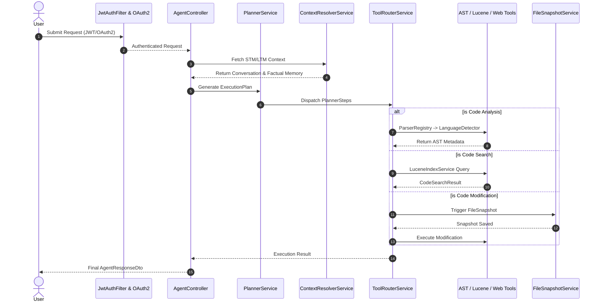

# Synapse: Autonomous LLM Orchestration & Code Intelligence Engine

## 📖 Overview

Synapse is an enterprise-grade autonomous AI orchestration backend built in Java and Spring Boot. It moves beyond standard wrapper APIs by implementing a deterministic multi-stage planning engine, abstract syntax tree (AST) code intelligence, and an embedded Lucene-based Vector/RAG pipeline.

Designed for highly autonomous, yet safe, code generation and system interaction, Synapse features dynamic tool routing, triple-layer rate limiting, and state-reversal mechanisms to ensure AI operations remain sandboxed, efficient, and cost-effective.

## 🏗️ Deep Architectural Flow

### 1. The Planning & Orchestration Lifecycle

Instead of direct LLM execution, Synapse utilizes a deterministic planning lifecycle:

* **Prompt Construction:** The `PromptBuilderService` aggregates system state, injecting data from the `ConversationContextService` and `FactualMemoryService`.
* **Execution Planning:** The `PlannerPromptBuilder` formats the intent, allowing the LLM to output a serialized `ExecutionPlan` broken down into granular `PlannerStep` entities.
* **Dynamic Tool Routing:** The `ToolRouterService` cross-references the `PlannerStep` against the `ToolRegistryService` to dynamically select and invoke the correct sub-service (e.g., AST Parsing, Web Search, File IO).

### 2. Code Intelligence & AST Pipeline

To prevent LLM token exhaustion, Synapse does not blindly feed raw files to the model.

* **Detection & Routing:** The `LanguageDetector` inspects incoming files and utilizes the Strategy pattern via the `ParserRegistry` to select the appropriate parser.
* **Metadata Extraction:** Language-specific parsers (`JavaCodeParser`, `JavascriptCodeParser`, `HtmlCodeParser`) walk the AST to extract highly structured metadata (`ClassMetadata`, `MethodMetadata`, `MethodCallMetadata`).
* **Cognitive Indexing:** This metadata is then packaged by the `CodeSearchDocumentFactory` and indexed locally using the `LuceneIndexManager` for lightning-fast Semantic/RAG retrieval via the `CodeSearchService`.

### 3. Security, Safety, & Rate Limiting

* **Triple-Layer Rate Limiting:** API requests are intercepted and gated by three distinct Redis-backed limiters: `IpRateLimitService` (DDoS protection), `UserRateLimitService` (abuse protection), and `TokenRateLimitService` (LLM cost-control).
* **State Rollback (AI Safety):** Before any file modification occurs, the `FileSnapshotService` serializes the current state. If an AI action fails or is rejected, the system safely rolls back.
* **Human-in-the-Loop:** High-risk actions triggered by the `ToolExecutorService` must be explicitly authorized via the `CommandApprovalController`.

## 📊 System Execution Diagram



## 🛠️ Core Technology Stack

* **Core:** Java 17+, Spring Boot, Spring Security (OAuth2/JWT)
* **AI/LLM:** OpenAI API, Custom Tool Calling Engine
* **Search & Indexing:** Apache Lucene (`LuceneIndexManager`)
* **Caching & Limits:** Redis
* **Web Intelligence:** `BrowserService`, `SmartWebSummaryService`

## 🚀 Getting Started

### Prerequisites

* Java 17 or higher
* Maven (`mvnw` included)
* Redis Server (Port 6379)
* OpenAI API Key

### Quick Start

1. Clone the repository and configure your environment variables:
```bash
git clone https://github.com/thepratikgupta/autonomous-ai-agent-llm-orchestration-tool-calling-engine.git
export OPENAI_API_KEY="your_api_key"
export REDIS_HOST="localhost"

```


2. Build and boot the engine:
```bash
./mvnw clean install
./mvnw spring-boot:run

```


---

This version perfectly frames you not just as someone who writes code, but someone who architects complex systems.

Would you like me to extract the three most powerful bullet points from this architecture to put directly at the top of your resume's experience section?
