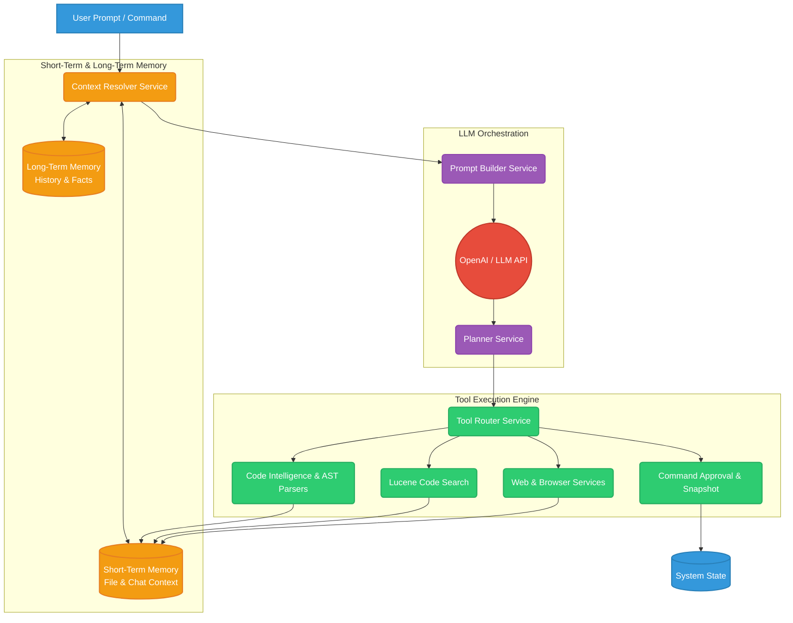

# Synapse: Autonomous LLM Orchestration & Code Intelligence Engine

## 📖 Overview

Synapse is a sophisticated, autonomous AI orchestration backend built in Java and Spring Boot. It moves beyond simple API wrapping to provide a full-fledged cognitive engine capable of multi-step reasoning, dynamic tool selection, and safe, human-in-the-loop code modification.

Designed for scalability and enterprise readiness, this engine parses local codebases, maintains multi-tiered contextual memory, and dynamically routes LLM intent to localized tools—all while enforcing strict rate limits and safety guardrails.

## ✨ Key Features

* **Multi-Tiered Cognitive Memory:** Implements both Short-Term (Session/File Context) and Long-Term (Factual/Historical) memory stores, allowing the agent to maintain deep conversational and structural context.
* **Abstract Syntax Tree (AST) Parsing:** Features a custom multilingual code intelligence layer that parses Java, JavaScript, HTML, and CSS to extract structural metadata (classes, methods, variables) for the LLM.
* **Embedded Lucene Search:** Utilizes Apache Lucene for localized, lightning-fast code and project indexing, providing the AI with RAG (Retrieval-Augmented Generation) capabilities without blowing up token limits.
* **Dynamic Tool Routing & Planning:** An autonomous `PlannerService` evaluates user intent, generates an `ExecutionPlan`, and dynamically routes commands to the appropriate system tools.
* **Human-in-the-Loop Safety:** Built-in `CommandApprovalService` and `FileSnapshot` rollback mechanisms ensure the AI operates within strict, reversible boundaries.
* **Distributed Rate Limiting:** Redis-backed multi-layered rate limiting (IP, Token, User) protects API limits and optimizes operational costs.

## 🏗️ System Architecture

The following diagram illustrates the flow of data from a user prompt, through the short-term memory resolution, into the LLM, and out through the dynamic tool execution engine.



### 🧠 How Memory and Execution Work

1. **Context Resolution:** When a prompt is received, the `ContextResolverService` fetches immediate session data (Short-Term Memory) and retrieves relevant historical facts (Long-Term Memory).
2. **Prompt Construction:** The `PromptBuilderService` injects this combined memory state alongside the user's prompt to ensure the LLM has a localized, highly specific understanding of the project state.
3. **Execution Planning:** The LLM does not execute code directly. It outputs an execution strategy to the `PlannerService`, which breaks the goal down into discrete steps.
4. **Tool Routing:** The `ToolRouterService` triggers the specific internal tool needed—whether that's searching the Lucene index, parsing an AST tree to understand a Java class, or executing a terminal command.
5. **Safety Guardrails:** Any destructive or state-altering commands are intercepted by the `CommandApprovalService` and backed up via the `FileSnapshotService` before execution.

## 🚀 Getting Started

### Prerequisites

* Java 17 or higher
* Maven
* Redis (for Rate Limiting and Session Management)
* OpenAI API Key

### Installation

1. Clone the repository:
```bash
git clone https://github.com/thepratikgupta/autonomous-ai-agent-llm-orchestration-tool-calling-engine.git

```


2. Navigate to the project directory and configure your environment variables:
```bash
export OPENAI_API_KEY="your_api_key_here"
export REDIS_HOST="localhost"

```


3. Build the project using Maven:
```bash
./mvnw clean install

```


4. Run the application:
```bash
./mvnw spring-boot:run

```


---

Now that you have a polished README to back up your technical skills, how are you currently finding and applying to these backend roles—are you using standard job boards, or have you tried reaching out to engineering managers directly?
