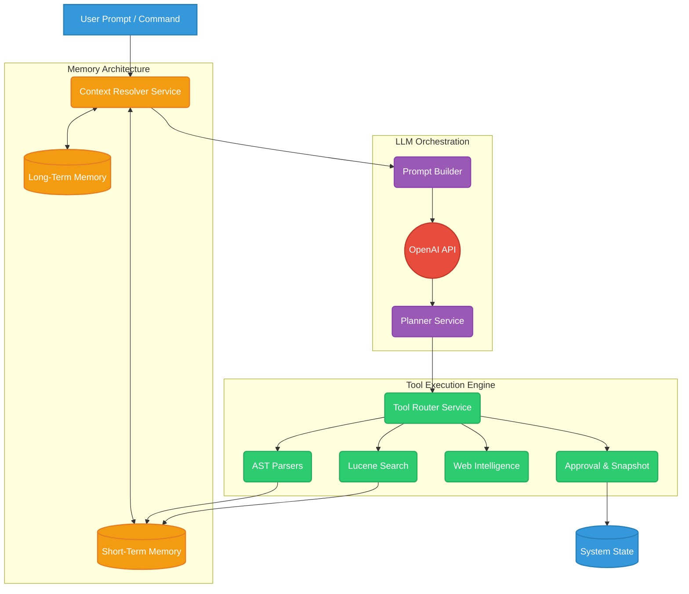
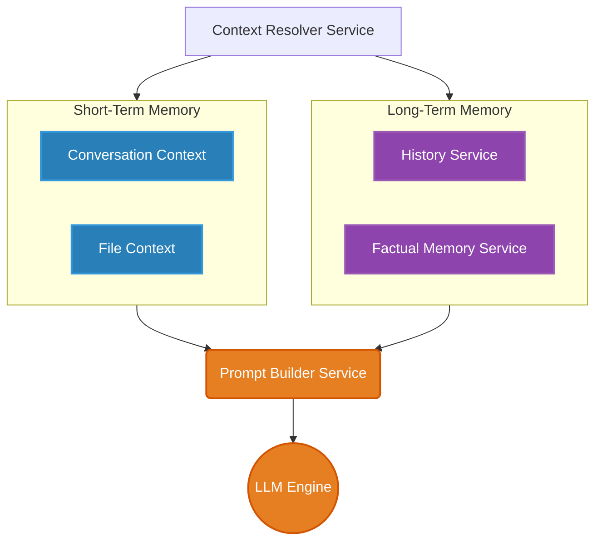
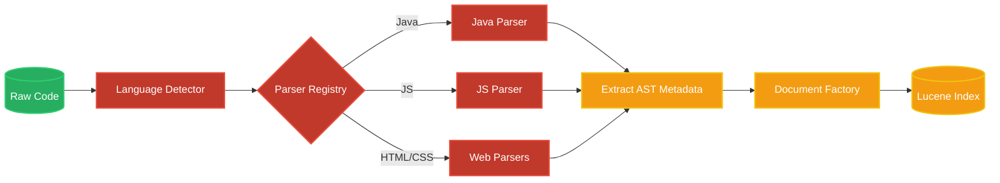
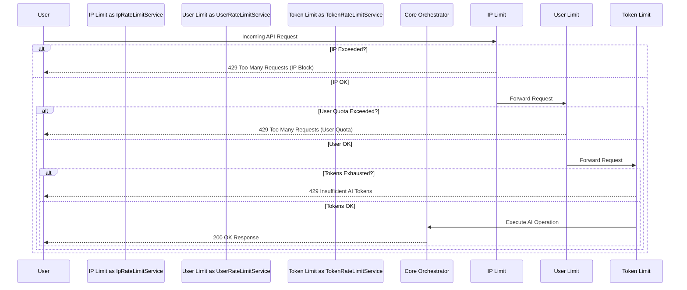
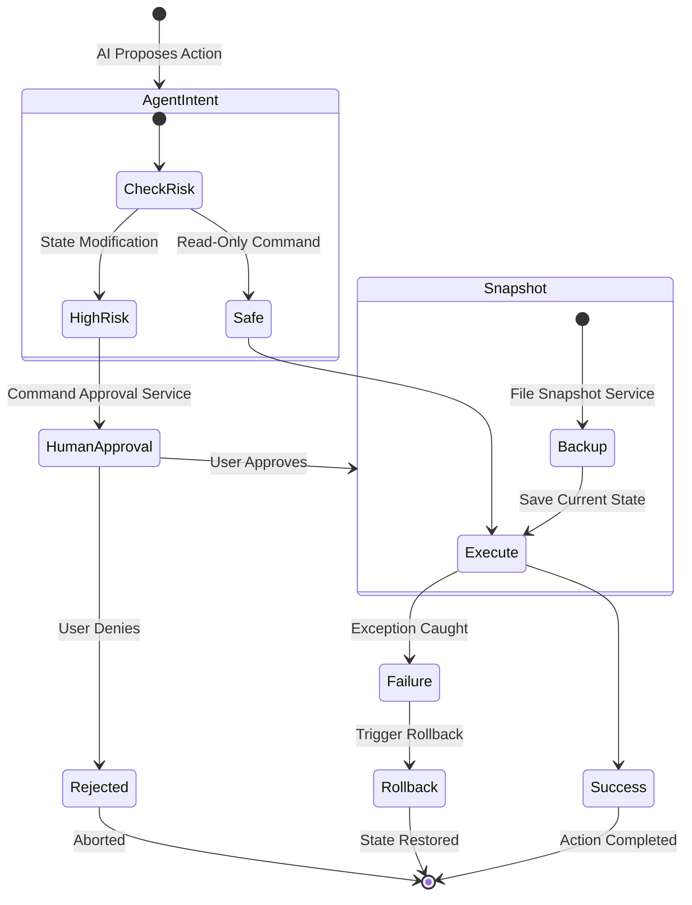

# Synapse: Autonomous LLM Orchestration & Code Intelligence Engine

## 📖 Overview

Synapse is an enterprise-grade autonomous AI orchestration backend built in Java and Spring Boot. It moves beyond standard wrapper APIs by implementing a deterministic multi-stage planning engine, abstract syntax tree (AST) code intelligence, and an embedded Lucene-based RAG (Retrieval-Augmented Generation) pipeline.

Designed for highly autonomous, yet safe, code generation and system interaction, Synapse features dynamic tool routing, triple-layer rate limiting, and transactional state-reversal mechanisms to ensure AI operations remain sandboxed, efficient, and secure.

---

## ✨ Key Features

* **Multi-Tiered Cognitive Memory:** Implements both Short-Term (Session/File Context) and Long-Term (Factual/Historical) memory stores, allowing the agent to maintain deep conversational and structural context.
* **Abstract Syntax Tree (AST) Parsing:** Features a custom multilingual code intelligence layer that parses Java, JavaScript, HTML, and CSS to extract structural metadata (classes, methods, variables) for the LLM.
* **Embedded Lucene Search:** Utilizes Apache Lucene for localized, lightning-fast code and project indexing, providing the AI with RAG capabilities without blowing up token limits.
* **Dynamic Tool Routing & Planning:** An autonomous `PlannerService` evaluates user intent, generates an `ExecutionPlan`, and dynamically routes commands to the appropriate system tools.
* **Human-in-the-Loop Safety:** Built-in `CommandApprovalService` and `FileSnapshot` rollback mechanisms ensure the AI operates within strict, reversible boundaries.
* **Distributed Rate Limiting:** Redis-backed multi-layered rate limiting (IP, Token, User) protects API limits and optimizes operational costs.

---

## 🏗️ Deep Architectural Flow

### 1. High-Level System Architecture

The following diagram illustrates the lifecycle of a user prompt, passing through memory resolution, into the LLM planner, and out through the dynamic tool execution engine.



### 2. The RAG & Cognitive Memory Pipeline

Synapse manages state and context across multiple sessions, combining immediate file context with historical factual data before querying the LLM.



### 3. Code Intelligence & Indexing Flow

To prevent context-window exhaustion, files are dynamically routed to language-specific AST parsers. The extracted structural metadata is then indexed into Apache Lucene for semantic retrieval.



### 4. Triple-Layer Rate Limiting & Gateway

API requests are strictly gated by three distinct Redis-backed limiters to protect against DDoS attacks, abuse, and API budget exhaustion.



### 5. AI Safety & Transactional Rollback

High-risk actions generated by the AI require explicit human authorization, and system state is snapshotted before execution to ensure flawless rollbacks upon failure.


---
## Architectural Explanation

### -> The Planning & Orchestration Lifecycle

Instead of direct LLM execution, Synapse utilizes a deterministic planning lifecycle:

* **Prompt Construction:** The `PromptBuilderService` aggregates system state, injecting data from the `ConversationContextService` and `FactualMemoryService`.
* **Execution Planning:** The `PlannerPromptBuilder` formats the intent, allowing the LLM to output a serialized `ExecutionPlan` broken down into granular `PlannerStep` entities.
* **Dynamic Tool Routing:** The `ToolRouterService` cross-references the `PlannerStep` against the `ToolRegistryService` to dynamically select and invoke the correct sub-service (e.g., AST Parsing, Web Search, File IO).

### -> Code Intelligence & AST Pipeline

To prevent LLM token exhaustion, Synapse does not blindly feed raw files to the model.

* **Detection & Routing:** The `LanguageDetector` inspects incoming files and utilizes the Strategy pattern via the `ParserRegistry` to select the appropriate parser.
* **Metadata Extraction:** Language-specific parsers (`JavaCodeParser`, `JavascriptCodeParser`, `HtmlCodeParser`) walk the AST to extract highly structured metadata (`ClassMetadata`, `MethodMetadata`, `MethodCallMetadata`).
* **Cognitive Indexing:** This metadata is then packaged by the `CodeSearchDocumentFactory` and indexed locally using the `LuceneIndexManager` for lightning-fast Semantic/RAG retrieval via the `CodeSearchService`.

### -> Security, Safety, & Rate Limiting

* **Triple-Layer Rate Limiting:** API requests are intercepted and gated by three distinct Redis-backed limiters: `IpRateLimitService` (DDoS protection), `UserRateLimitService` (abuse protection), and `TokenRateLimitService` (LLM cost-control).
* **State Rollback (AI Safety):** Before any file modification occurs, the `FileSnapshotService` serializes the current state. If an AI action fails or is rejected, the system safely rolls back.
* **Human-in-the-Loop:** High-risk actions triggered by the `ToolExecutorService` must be explicitly authorized via the `CommandApprovalController`.

### -> How Memory and Execution Work

* **Context Resolution:** When a prompt is received, the `ContextResolverService` fetches immediate session data (Short-Term Memory) and retrieves relevant historical facts (Long-Term Memory).
* **Prompt Construction:** The `PromptBuilderService` injects this combined memory state alongside the user's prompt to ensure the LLM has a localized, highly specific understanding of the project state.
* **Execution Planning:** The LLM does not execute code directly. It outputs an execution strategy to the `PlannerService`, which breaks the goal down into discrete steps.
* **Tool Routing:** The `ToolRouterService` triggers the specific internal tool needed—whether that's searching the Lucene index, parsing an AST tree to understand a Java class, or executing a terminal command.
* **Safety Guardrails:** Any destructive or state-altering commands are intercepted by the `CommandApprovalService` and backed up via the `FileSnapshotService` before execution.

## 🚀 Getting Started

### Prerequisites

* Java 17 or higher
* Maven
* Redis (for Rate Limiting and Session Management)
* OpenAI API Key (Suggestion: Use OpenRouter)

## 🛠️ Core Technology Stack

* **Core:** Java 17+, Spring Boot, Spring Security (OAuth2/JWT), Spring MVC, Spring IOC, DI ,REST APIs
* **AI/LLM:** OpenAI API, OpenRouter, OpenAI SDK, Custom Tool Calling Engine
* **Developer Tools:** Postman, IntelliJ IDEA, Docker Desktop, MongoDB Compass, Redis Insight
* **Search & Indexing:** Apache Lucene (`LuceneIndexManager`), Custom Indexing
* **Caching & Limits:** Redis
* **Web Intelligence:** Using custom tools like `BrowserTool`, `WebSearchTool`

## ⚙️ Configuration & Setup

Because this is a complex, distributed backend service, you must configure several environment parameters before booting the application. Configuration properties are handled across `src/main/resources/application.properties` and `src/main/resources/application.yml`.

### Step 1: Environment Variables

Based on the integrated services (Redis, OpenAI, OAuth2, JWT), you need to provide the following keys in your `.properties` or `.yml` file:

**In `application.yml` (Recommended for hierarchical structure):**

```yaml
spring:
  datasource:
    url: jdbc:postgresql://localhost:5432/synapsedb # Or your preferred SQL database
    username: ${DB_USERNAME}
    password: ${DB_PASSWORD}
  
  data:
    redis:
      host: localhost
      port: 6379

  security:
    oauth2:
      client:
        registration:
          google:
            client-id: ${GOOGLE_CLIENT_ID}
            client-secret: ${GOOGLE_CLIENT_SECRET}
          github:
            client-id: ${GITHUB_CLIENT_ID}
            client-secret: ${GITHUB_CLIENT_SECRET}

app:
  jwt:
    secret: ${JWT_SECRET_KEY} # Must be a strong, Base64-encoded 256-bit key
    expiration: 86400000

openai:
  api:
    key: ${OPENAI_API_KEY}
    model: gpt-4-turbo # Or your preferred model

```

*Note: You can inject these directly via your OS environment variables to avoid hardcoding secrets in your repository.*

### Step 2: Build and Run

Clone the repository and run the application using the included Maven wrapper:

```bash
# Clone the project
git clone https://github.com/thepratikgupta/autonomous-ai-agent-llm-orchestration-tool-calling-engine.git
cd autonomous-ai-agent-llm-orchestration-tool-calling-engine

# Build the project
./mvnw clean install

# Boot the Spring application
./mvnw spring-boot:run

```
